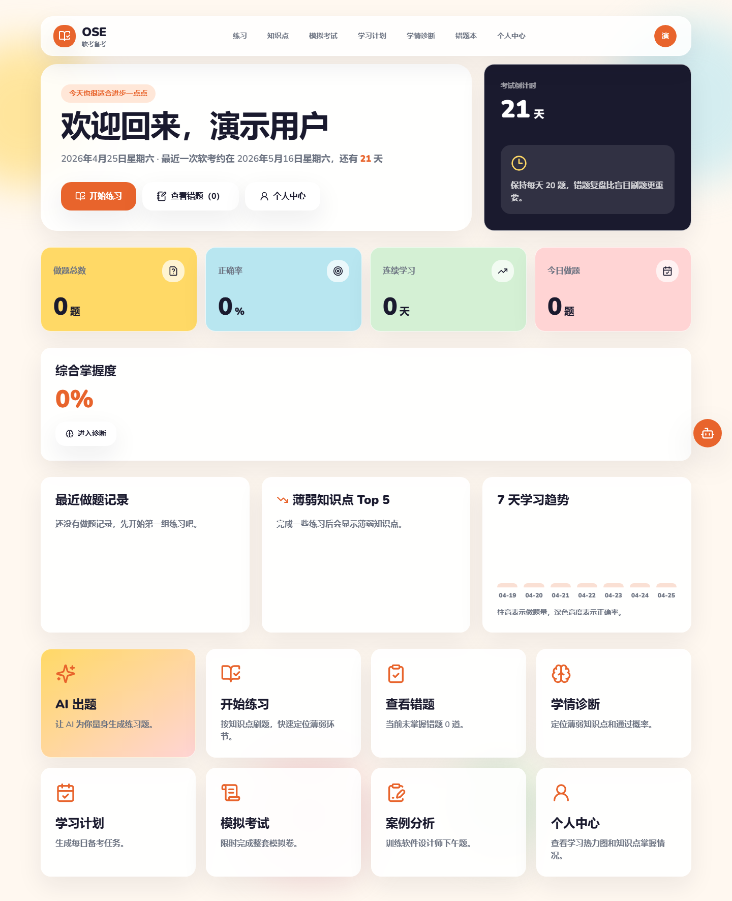
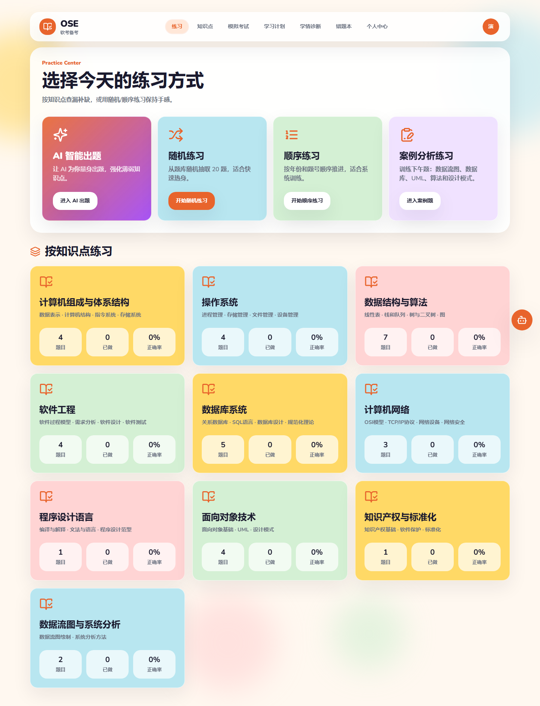
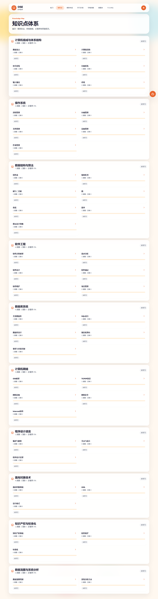
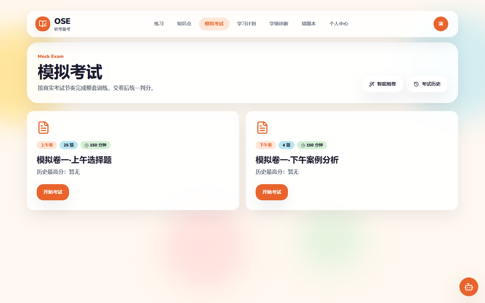
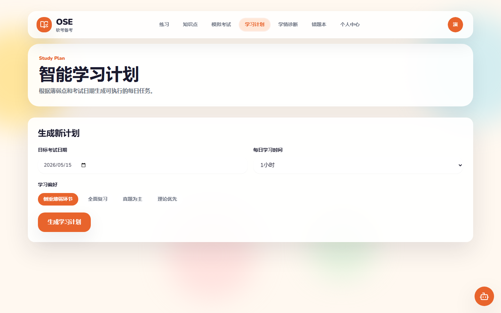
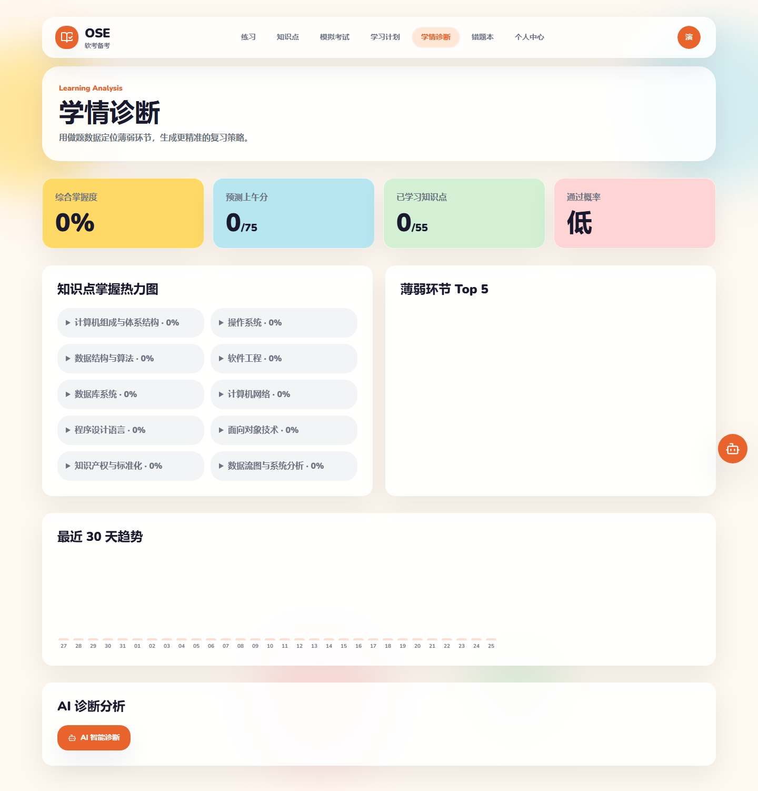

# OSE

```text
   ____   _____ ______
  / __ \ / ___// ____/
 / / / / \__ \/ __/
/ /_/ / ___/ / /___
\____/ /____/_____/
Open Software Exam
```

面向中国软考的软件设计师考试的开源 AI 备考平台。

[](https://github.com/hacksynth/ose/stargazers)
[](LICENSE)
[](CONTRIBUTING.md)
[](https://github.com/hacksynth/ose/actions/workflows/ci.yml)

Screenshots coming soon

## OSE 是什么？

OSE（Open Software Exam）是一个专为中国软考软件设计师考试打造的开源备考平台。它把题库练习、案例分析、模拟考试、错题本、学情分析和 AI 辅助整合到一个可自部署的学习工作台中。

OSE 面向正在备考的考生、需要透明题库和学习数据的老师，以及希望搭建私有化 AI 培训系统的团队。系统围绕真实备考流程设计：学习知识点、刷题、复盘错题、参加模拟考试，再根据数据调整学习计划。

OSE 的核心卖点是：**AI 驱动**、**开源共建**、**可自部署**。你可以接入 Claude、OpenAI、Gemini 或任意 OpenAI 兼容接口，也可以把数据保存在自己的数据库中。

## 功能特性

- 📚 **内置题库**：2014–2025 年 41 套软考软件设计师历年真题 — 1483 道单选/完形单选 + 96 个案例场景 / 263 道小问，已通过 AI 自动归类到 56 个叶子知识点；自部署跑一遍 `db:seed` 即可直接刷题。
- 🤖 **AI 辅助**：支持 Claude、OpenAI、Gemini、自定义端点，提供 AI 讲解、批改、出题、诊断和学习计划。
- 📊 **学情分析**：知识点掌握度热力图、薄弱诊断、预测得分、通过概率评估。
- 📝 **模拟考试**：真实考试模拟，倒计时、答题卡、成绩报告。
- 🧭 **智能学习计划**：根据目标考试日期和当前基础生成个性化备考计划。
- 🖥️ **多平台**：Web、Tauri 桌面端（Win/Linux/macOS）、Android PWA。
- 🔌 **多 AI 供应商**：Claude、OpenAI、Gemini、自定义 OpenAI 兼容接口。

## 技术栈


## 快速开始

```bash
git clone https://github.com/hacksynth/ose.git
cd ose
cp .env.example .env
npm install
npx prisma migrate dev
npx prisma db seed
npm run dev
```

打开 `http://localhost:3000`，注册第一个账号即可开始使用。`db:seed` 会从 `data/51cto-seed.json`（由 `data/51cto-exams/` 转换得到）写入 41 套真题、1579 道题、96 个案例,数据来源与处理流水线见 `data/51cto-exams/INDEX.md`。

## 自部署指南

OSE 支持 Docker、VPS 和 Vercel 类平台部署。OSE 目前内置并支持 SQLite。PostgreSQL 生产部署支持仍在路线图中，当前版本尚未可用。

详细步骤见 [docs/self-hosting.md](docs/self-hosting.md)。

## 截图 / Demo

| 工作台                                           | 练习中心                                          |
| ------------------------------------------------ | ------------------------------------------------- |
|  |  |

| 知识点体系                                           | 模拟考试                                      |
| ---------------------------------------------------- | --------------------------------------------- |
|  |  |

| 学习计划                                      | 学情诊断                                          |
| --------------------------------------------- | ------------------------------------------------- |
|  |  |

截图由 `scripts/capture-screenshots.mjs` 在本地开发服务器上自动生成，UI 改动后可重新运行：

```bash
npm run dev
node scripts/capture-screenshots.mjs
```

## 路线图

- [x] Phase 1: 选择题题库 + 练习 + 错题本
- [x] Phase 2: 案例分析题 + 模拟考试 + 知识点体系
- [x] Phase 3: AI 辅助（讲解/批改/出题/诊断/学习计划）
- [x] Tauri 桌面版（支持 BUNDLE_NODE=1 自包含 Node.js 运行时）
- [ ] 更多软考科目支持（信息系统项目管理师等）
- [x] 历年真题内置（2014–2025，41 套，1579 题）
- [ ] PostgreSQL 生产部署支持
- [ ] Docker Compose 一键部署
- [ ] 国际化（i18n）
- [x] 移动端 PWA（Android / 桌面浏览器）
- [ ] 社区讨论/评论功能
- [ ] 题库贡献平台

## 参与贡献

欢迎贡献代码、文档、题库数据、问题复现、翻译和产品建议。请先阅读 [CONTRIBUTING.md](CONTRIBUTING.md)，也可以从 [.github/GOOD_FIRST_ISSUES.md](.github/GOOD_FIRST_ISSUES.md) 中挑选适合新贡献者的任务。

## 许可证

OSE 使用 [AGPL-3.0](LICENSE) 许可证。如果你修改 OSE 并作为网络服务提供给用户，需要按同一许可证公开修改后的源码。
